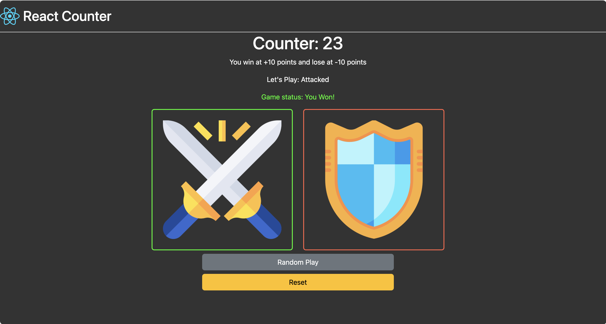

# React Counter Game

This is a simple counter game built with React and TypeScript. The game is a fun way to understand the basic concepts of React and TypeScript.

## Project Structure

The project is structured as follows:

- `src/`: This directory contains all the TypeScript and React code.
  - `App.tsx`: This is the main component that renders the `Header` and `Counter` components.
  - `Counter.tsx`: This component contains the logic for the counter game. It uses React's useState hook to manage the game state.
  - `Header.tsx`: This component displays the header of the application.
- `public/`: This directory contains static files like images.
- `package.json`: This file contains the list of project dependencies and scripts.
- `tsconfig.json`: This file is used to specify the root files and the compiler options required to compile the project.
- `vite.config.ts`: This file is used to configure Vite, the build tool used in this project.

## Game Rules

The game rules are simple:

- You can either attack or defend.
- When you attack, a random number is added to your score.
- When you defend, a random number is subtracted from your score.
- You win if your score reaches +15 and lose if it reaches -15.

## Installation

To install the project, follow these steps:

1. Clone the repository: `git clone https://github.com/adelansari/react-counter.git`
2. Navigate to the project directory: `cd react-counter`
3. Install the dependencies: `npm install`

## Running the Project

To run the project, use the following command: `npm run dev`

## Building the Project

To build the project, use the following command: `npm run build`

## Linting the Project

To lint the project, use the following command: `npm run lint`

## Contributing

Contributions are welcome. Please open an issue or submit a pull request.